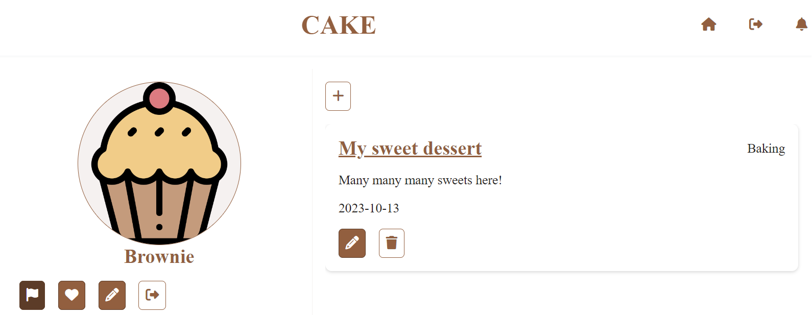
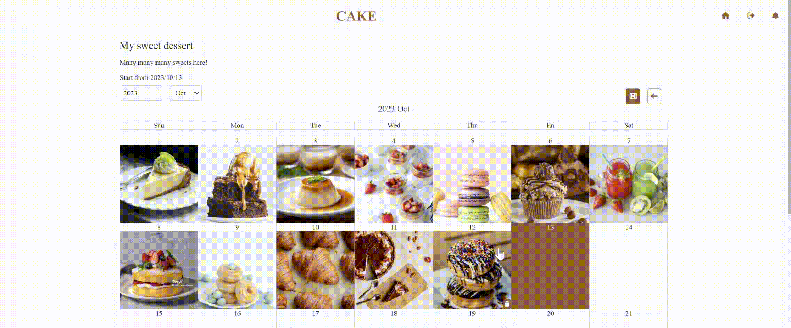
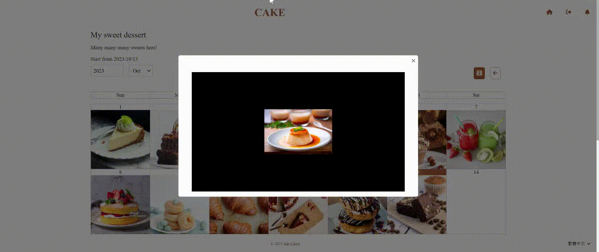

# Cake
Powered by .NET 6 and Angular 14.
## About
Cake is an web APP, where you can set any goals and assist in achieving it by uploading photos every day, helping you to stay committed. You can also review your progress through images, just like a diary filled with your hard work.
    
## Three Steps
1. Set up a Plan
    - Whether you're striving for personal growth, embarking on a creative project, or simply looking to appreciate life's little moments, Cake allows you to set and track your goals with ease.
    
2. Daily Photo Uploads
    - Upload only one photo a day, giving you the power to preserve the moments that matter most to you. It's like building a visual story of your life, one snapshot at a time.
    
3. Monthly Video Creation
    - At the end of each month, Cake lets you effortlessly compile all your daily photos into a stunning video montage. Relive the past month's memories and share your journey with friends and family.
    